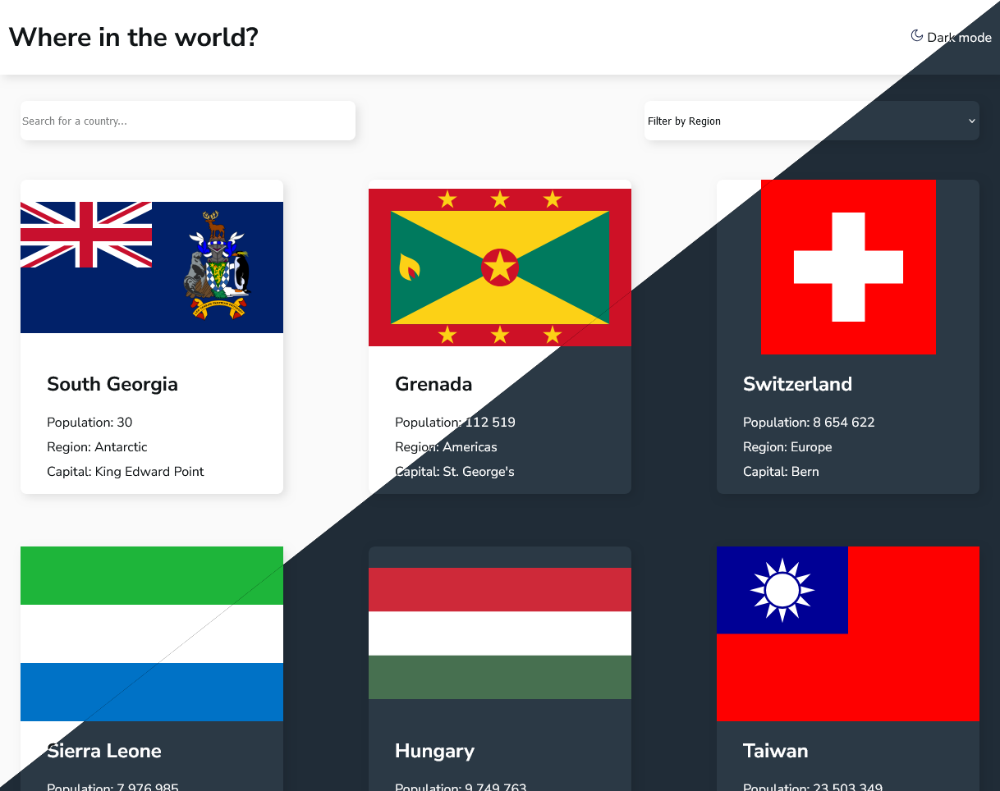

# Frontend Mentor - REST Countries API with color theme switcher solution

This is a solution to the [REST Countries API with color theme switcher challenge on Frontend Mentor](https://www.frontendmentor.io/challenges/rest-countries-api-with-color-theme-switcher-5cacc469fec04111f7b848ca). Frontend Mentor challenges help you improve your coding skills by building realistic projects.

## Table of contents

- [Frontend Mentor - REST Countries API with color theme switcher solution](#frontend-mentor---rest-countries-api-with-color-theme-switcher-solution)
	- [Table of contents](#table-of-contents)
	- [Overview](#overview)
		- [The challenge](#the-challenge)
		- [Screenshot](#screenshot)
		- [Links](#links)
	- [My process](#my-process)
		- [Built with](#built-with)
		- [What I learned](#what-i-learned)
		- [Continued development](#continued-development)
		- [Useful resources](#useful-resources)
	- [Author](#author)

**Note: Delete this note and update the table of contents based on what sections you keep.**

## Overview

### The challenge

Users should be able to:

- See all countries from the API on the homepage
- Search for a country using an `input` field
- Filter countries by region
- Click on a country to see more detailed information on a separate page
- Click through to the border countries on the detail page
- Toggle the color scheme between light and dark mode *(optional)*

### Screenshot




### Links

- Solution URL: [Github](https://github.com/Z0ul0u25/FeM-countries_API/settings/pages)
- Live Site URL: [Github Pages](https://z0ul0u25.github.io/FeM-countries_API/)

## My process

### Built with

- Semantic HTML5 markup

- SASS Preprocessor
- Flexbox
- Mobile-first workflow

- TypeScript

- [REST Countries API](https://restcountries.com/)


### What I learned

I learned about asynchronous API call with error handling.

```ts
async function getOneCountry(cca3: string): Promise<any> {
	let url: string = `API_URL`;

	let response = await fetch(url);
	if (!response.ok) {
		response = await fetch("../data.json");
	}

	return response.json();
}
```

I also learned about the `URLSearchParams` object in JS. With this URL can be shared and saved to go straight to a country page.

```ts
let cca3: URLSearchParams = new URLSearchParams(window.location.search);
// ...
getOneCountry(cca3.get("name")).then((data) => {
	if (data.length > 1) {
		data = data.filter((country) => cca3.get("name").includes(country.cca3))[0];
	}
	displayOneCountry(data);
});
```

### Continued development

Next step would be to cache the data to make less calls to the API and help server load.

### Useful resources

- [JS Promise](https://developer.mozilla.org/fr/docs/Web/JavaScript/Reference/Global_Objects/Promise) - This helped me understand the concept of `Promise` in JS.
- [Theming in SASS - by Stuart Roskelley](https://medium.com/@sroskelley/theming-in-sass-67b8c0265e3f) - This helped a lot making theming easier with SASS

## Author

- Github - [Z0ul0u25](https://github.com/Z0ul0u25)
- Frontend Mentor - [@Z0l0u25](https://www.frontendmentor.io/profile/Z0ul0u25)
- Linkedin - [Philippe G](https://www.linkedin.com/in/philippe-gourdeau)
